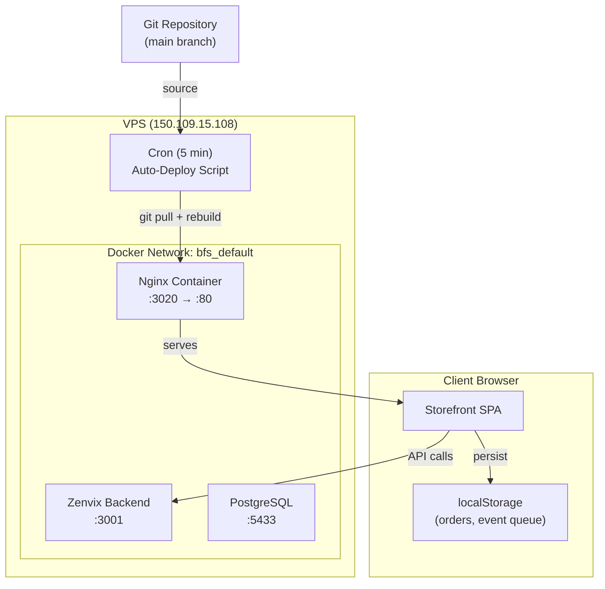
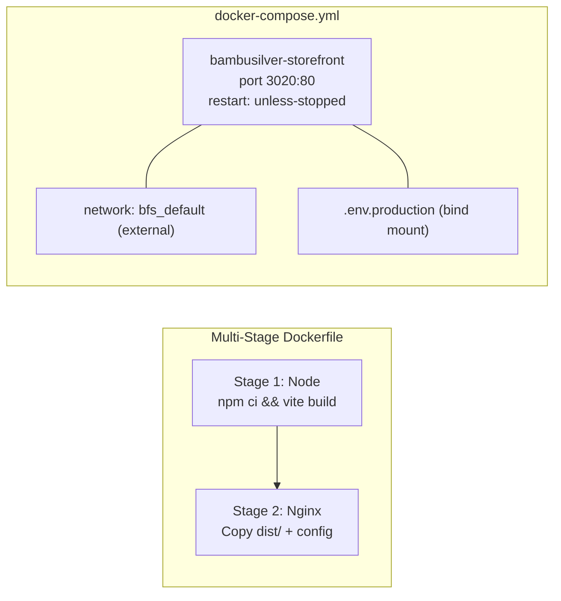
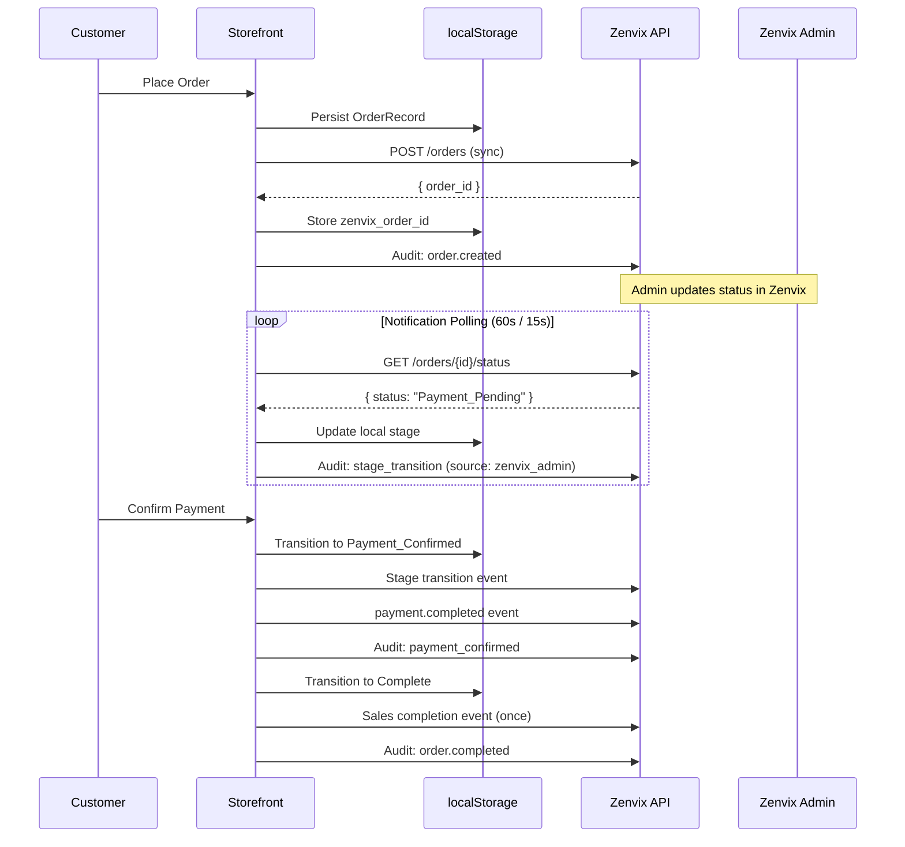

# Design Document: VPS Deployment & Zenvix Integration

## Overview

This design covers two major areas: (1) containerized deployment of the Bambu Silver storefront on the VPS alongside the existing Zenvix stack, and (2) full bidirectional order lifecycle integration between the storefront and Zenvix's backend services.

The storefront is a Vite/React SPA currently deployed via Netlify. This feature migrates it to a Docker container served by Nginx on port 3020 of the VPS (150.109.15.108), joining the existing `bfs_default` Docker network. An automated deploy script keeps the container in sync with the main branch.

On the integration side, the existing event pipeline (`zenvix-events.ts`) and order sync module (`zenvix-order-sync.ts`) are extended to provide:
- Full order creation sync with Zenvix order_id persistence
- Stage transition sync with sequential ordering guarantees
- Notification polling for Zenvix-originated status changes
- Sales module completion events
- Marketing attribution via Channel_Record_ID
- Structured audit trail logging with trace_id correlation

### Key Design Decisions

1. **Client-side sync architecture**: The storefront is an SPA with no server-side component. All Zenvix communication happens client-side via the existing `zenvix-client.ts` fetch layer. The retry queue in localStorage provides resilience.

2. **Polling over WebSockets**: Zenvix doesn't expose a WebSocket endpoint for status push. The Notification_Poller uses configurable-interval HTTP polling with adaptive frequency (faster on the order tracker page).

3. **Sequential event ordering**: Stage transitions must be sent in order. The sync queue processes events per-order sequentially, using the existing `QueuedEvent` infrastructure extended with ordering metadata.

4. **Idempotency via order_id + event deduplication**: Sales completion events are sent at most once per order using a persisted "sent" flag.

## Architecture



### Deployment Architecture



### Order Sync Flow



## Components and Interfaces

### 1. Deployment Components

#### Dockerfile (Multi-Stage)

```dockerfile
# Stage 1: Build
FROM node:20-alpine AS builder
WORKDIR /app
COPY package*.json ./
RUN npm ci
COPY . .
RUN npm run build

# Stage 2: Serve
FROM nginx:alpine
COPY --from=builder /app/dist /usr/share/nginx/html
COPY nginx.conf /etc/nginx/conf.d/default.conf
COPY docker-entrypoint.sh /docker-entrypoint.d/40-inject-env.sh
RUN chmod +x /docker-entrypoint.d/40-inject-env.sh
EXPOSE 80
```

#### Nginx Configuration

- SPA fallback: `try_files $uri $uri/ /index.html`
- Static asset caching with appropriate headers
- Gzip compression for JS/CSS/HTML

#### Runtime Environment Injection

A shell script (`docker-entrypoint.sh`) generates a `window.__ENV__` configuration file at container start, injecting `VITE_*` environment variables into a JS file served with the app. This enables configuration changes without rebuilding the image.

#### Auto-Deploy Script (`vps-auto-deploy.sh`)

- Flock-based mutex to prevent concurrent executions
- Git pull with revision comparison
- Conditional `docker compose up -d --build`
- Timestamped logging to `/home/ubuntu/bambusilver/logs/deploy.log`

### 2. Integration Components

#### Order_Sync_Service (Enhanced `zenvix-order-sync.ts`)

Extends the existing sync module with:
- **Order creation**: POST to `/orders` with payment_status "PENDING", Channel_Record_ID attribution
- **Zenvix order_id storage**: Persists `zenvixOrderId` field on the OrderRecord in localStorage
- **Sequential queue**: Per-order FIFO processing of stage transitions
- **Deferred sends**: Queues transitions until order creation sync completes

```typescript
interface OrderSyncState {
  zenvixOrderId: string | null;
  syncStatus: 'pending' | 'synced' | 'sync_failed';
  pendingTransitions: QueuedTransition[];
  salesEventSent: boolean;
}
```

#### Notification_Poller (New Module)

- Configurable polling interval (default 60s, min 10s, max 300s)
- Adaptive frequency: 15s when on order tracker page
- Exponential backoff on errors (base 2s, cap 120s)
- Filters: only polls orders with `zenvixOrderId` and not in `Complete` stage
- Status mapping from Zenvix status strings to local `OrderStage`
- Forward-only updates: discards same/earlier stage responses

```typescript
interface PollerConfig {
  defaultIntervalMs: number;   // 60000
  activeIntervalMs: number;    // 15000
  minIntervalMs: number;       // 10000
  maxIntervalMs: number;       // 300000
  maxConsecutiveFailures: number; // 5
}
```

#### Event_Pipeline (Enhanced `zenvix-events.ts`)

Extends existing event pipeline with:
- `context.channel_record_id` field on all events from `VITE_ZENVIX_CHANNEL_RECORD_ID`
- Session UUID (generated once per session, stored in `sessionStorage`)
- Consistent `actor` object with `tenant_id` and `branch_id`
- `session.start` event on page load with referrer + source data

#### Audit_Logger (New Module)

- Structured audit entries for order lifecycle actions
- `trace_id` (UUID) per order, persisted with the order record
- Async, non-blocking: failures don't affect primary operations
- Uses existing retry queue with exponential backoff (max 5 retries)

```typescript
interface AuditEntry {
  action: 'order.created' | 'stage.transition' | 'payment.confirmed' | 'order.completed';
  order_id: string;
  trace_id: string;
  actor: { id: string; type: 'customer' | 'admin' };
  timestamp: string;  // ISO 8601 UTC
  metadata?: Record<string, unknown>;
}
```

### 3. Stage Mapping

| Storefront OrderStage | Zenvix Status |
|---|---|
| Order_Submitted | `SUBMITTED` |
| Quotation_Pending | `QUOTATION_PENDING` |
| Quotation_Sent | `QUOTATION_SENT` |
| Payment_Pending | `PAYMENT_PENDING` |
| Payment_Confirmed | `PAYMENT_CONFIRMED` |
| Complete | `COMPLETED` |

The mapping is bidirectional — used both for outbound sync and inbound polling resolution.

## Data Models

### Extended OrderRecord

```typescript
interface OrderRecord {
  // ... existing fields ...
  id: string;
  stage: OrderStage;
  customerName: string;
  customerEmail: string;
  customerPhone: string;
  shippingAddress: string;
  items: Array<{ productId: string; title: string; quantity: number; unitPrice: number }>;
  subtotal: number;
  quotedDeliveryCost?: number;
  quotedTotal?: number;
  paidAmount?: number;
  userId?: string;
  createdAt: string;
  updatedAt: string;
  stageHistory: Array<{ stage: OrderStage; timestamp: string; source?: 'local' | 'zenvix_admin' }>;
  
  // New fields for Zenvix sync
  zenvixOrderId?: string;
  syncStatus: 'pending' | 'synced' | 'sync_failed';
  traceId: string;           // UUID for audit correlation
  salesEventSent: boolean;   // Prevents duplicate sales events
}
```

### Sync Queue Entry

```typescript
interface SyncQueueEntry {
  id: string;
  orderId: string;           // Local order ID
  type: 'order_create' | 'stage_transition' | 'quotation' | 'payment' | 'sales_complete' | 'audit';
  payload: Record<string, unknown>;
  retries: number;
  maxRetries: number;        // 5
  nextRetryAt: number;       // Timestamp
  status: 'pending' | 'sent' | 'failed';
  sequenceNumber: number;    // For per-order ordering
  createdAt: string;
}
```

### Notification Poller State

```typescript
interface PollerState {
  activeOrders: Map<string, {
    localOrderId: string;
    zenvixOrderId: string;
    lastKnownStage: OrderStage;
    consecutiveFailures: number;
    paused: boolean;
  }>;
  isTrackerPageActive: boolean;
  currentInterval: number;
}
```

### Runtime Environment Configuration

```typescript
// Generated at container start as /usr/share/nginx/html/env-config.js
interface RuntimeConfig {
  VITE_ZENVIX_API_URL: string;
  VITE_ZENVIX_TENANT_ID: string;
  VITE_ZENVIX_CLIENT_ID: string;
  VITE_ZENVIX_CLIENT_SECRET: string;
  VITE_ZENVIX_CHANNEL_RECORD_ID: string;
  VITE_ZENVIX_BRANCH_ID: string;
  VITE_ZENVIX_API_KEY: string;
  VITE_WHATSAPP_OFFICE_PHONE: string;
}
```

### Docker Compose Service Definition

```yaml
version: "3.8"
services:
  bambusilver-storefront:
    build:
      context: .
      dockerfile: Dockerfile
    container_name: bambusilver-storefront
    ports:
      - "3020:80"
    networks:
      - bfs_default
    restart: unless-stopped
    volumes:
      - ./.env.production:/app/.env.production:ro

networks:
  bfs_default:
    external: true
```


## Correctness Properties

*A property is a characteristic or behavior that should hold true across all valid executions of a system—essentially, a formal statement about what the system should do. Properties serve as the bridge between human-readable specifications and machine-verifiable correctness guarantees.*

### Property 1: Order sync payload contains all required fields

*For any* valid OrderRecord, the order creation payload sent to Zenvix SHALL contain: items array (each with SKU and quantity), customer object (email and name), payment_status = "PENDING", and channel_record_id matching the configured VITE_ZENVIX_CHANNEL_RECORD_ID.

**Validates: Requirements 4.1, 4.5**

### Property 2: Zenvix order_id is persisted on successful sync

*For any* successful order creation response containing an order_id string, the local OrderRecord SHALL be updated with that zenvixOrderId value in localStorage.

**Validates: Requirements 4.2**

### Property 3: Exponential backoff produces correct delay

*For any* retry attempt N (where 0 ≤ N < maxRetries), the next retry delay SHALL equal baseDelay × 2^N, capped at the configured maximum (120s for poller, uncapped for sync queue within 5 retries).

**Validates: Requirements 4.3, 6.4, 7.4**

### Property 4: Terminal failure preserves event data

*For any* sync queue entry that has exhausted its maximum retries (5), the entry status SHALL be "failed" and the original payload data SHALL remain intact and accessible in the local queue.

**Validates: Requirements 4.6, 6.5, 8.6**

### Property 5: Stage mapping is complete and bidirectional

*For any* of the 6 OrderStage values, the mapping function SHALL return a non-null Zenvix status string, and for any valid Zenvix status string in the mapping, the reverse mapping SHALL return the corresponding OrderStage.

**Validates: Requirements 5.2**

### Property 6: Stage transition event payload correctness

*For any* valid stage transition (from a stage S to the next valid stage T), the sync event payload SHALL contain the order_id, from_stage = S, to_stage = T, and a valid ISO 8601 UTC timestamp.

**Validates: Requirements 5.1, 5.3**

### Property 7: Per-order sequential transition ordering

*For any* order with multiple queued stage transitions, the sync queue SHALL process them in monotonically increasing sequence number order, such that no later transition is sent before an earlier one for the same order.

**Validates: Requirements 5.5**

### Property 8: Deferred transitions until order_id available

*For any* order where zenvixOrderId is null, all queued stage transitions SHALL remain in "deferred" status and SHALL NOT be sent to the API until the order creation sync completes and populates the zenvixOrderId.

**Validates: Requirements 5.6**

### Property 9: Sync operations do not block local state changes

*For any* order lifecycle operation (creation, transition, audit), the local state change SHALL complete successfully regardless of whether the corresponding Zenvix sync request succeeds or fails.

**Validates: Requirements 5.4, 10.5**

### Property 10: Quotation and payment event payload correctness

*For any* quotation event with delivery cost D and total T, the payload SHALL contain order_id, delivery_cost = D (numeric, ≤2 decimal places), total = T (numeric, ≤2 decimal places), and an ISO 8601 UTC timestamp. For any payment event with amount A, the payload SHALL contain order_id, amount = A, and an ISO 8601 UTC timestamp.

**Validates: Requirements 6.1, 6.2, 6.3**

### Property 11: Notification poller interval clamping

*For any* configured polling interval value V (in milliseconds), the effective polling interval SHALL be clamped to the range [10000, 300000].

**Validates: Requirements 7.1**

### Property 12: Forward-stage poller updates are applied correctly

*For any* order at local stage S, when the Notification_Poller detects a Zenvix status mapping to stage T where T is strictly later than S in the stage sequence, the local order SHALL advance to T and append a stageHistory entry with the new stage, timestamp, and source = "zenvix_admin".

**Validates: Requirements 7.2, 11.1, 11.3**

### Property 13: Backward or same-stage poller updates are discarded

*For any* order at local stage S, when the Notification_Poller receives a Zenvix status mapping to stage T where T is the same as or earlier than S in the stage sequence, the local order SHALL remain at stage S with no modifications.

**Validates: Requirements 7.6, 11.2**

### Property 14: Poller only polls eligible orders

*For any* set of orders in localStorage, the Notification_Poller SHALL only poll those that have a non-null zenvixOrderId AND whose current stage is not "Complete".

**Validates: Requirements 7.5**

### Property 15: Unmapped Zenvix status is ignored

*For any* Zenvix order status string that does not exist in the status-to-OrderStage mapping, the Notification_Poller SHALL leave the local order unchanged.

**Validates: Requirements 11.5**

### Property 16: Sales completion event payload correctness

*For any* order reaching the Complete stage, the sales event payload SHALL contain: items (each with product_id, quantity, unit_price), total paid amount (including delivery cost), customer data (name, email), and channel_record_id.

**Validates: Requirements 8.1, 8.2, 8.3**

### Property 17: Sales event is sent at most once per order

*For any* order where salesEventSent = true, calling the sales completion sync function SHALL produce no new queue entries and SHALL NOT send any API request.

**Validates: Requirements 8.5**

### Property 18: Event pipeline structure consistency

*For any* event sent through the Event_Pipeline, the event object SHALL contain: context.channel_record_id (matching configured value), actor.id (session UUID or user ID), actor.type ("customer" or "guest"), actor.tenant_id, and actor.branch_id.

**Validates: Requirements 9.1, 9.2, 9.5**

### Property 19: Cart checkout event payload completeness

*For any* valid cart state with N items (each having product_id, quantity, price), the cart.checkout event payload SHALL contain all N items with their fields, the total cart value (sum of quantity × price for each item), and the session identifier.

**Validates: Requirements 9.3**

### Property 20: Audit entry contains required fields per action type

*For any* audit action type, the audit entry SHALL contain: order_id, trace_id (UUID), actor (id + type), ISO 8601 UTC timestamp, and action-specific metadata (from_stage/to_stage for transitions, amount for payments).

**Validates: Requirements 10.1, 10.2, 10.3**

### Property 21: Trace ID is consistent across an order's lifetime

*For any* order, the trace_id generated at order creation SHALL be included in every subsequent audit entry (stage transitions, quotation, payment, completion) for that same order_id.

**Validates: Requirements 10.4**

### Property 22: Configuration fallback on missing required variables

*For any* combination where at least one of the four required environment variables (VITE_ZENVIX_API_URL, VITE_ZENVIX_TENANT_ID, VITE_ZENVIX_CLIENT_ID, VITE_ZENVIX_CLIENT_SECRET) is empty or missing, the Storefront SHALL return mock product data and isZenvixConfigured() SHALL return false.

**Validates: Requirements 3.4**

## Error Handling

### Network Failures

| Scenario | Behavior |
|---|---|
| Order creation POST fails (5xx/network) | Queue for retry, exponential backoff (2s base, max 5 attempts) |
| Order creation POST fails (4xx) | Do NOT retry, log error for investigation |
| Stage transition sync fails | Queue for retry, don't block local transition |
| Quotation/payment event fails | Queue for retry, same backoff parameters |
| Sales completion event fails | Queue for retry, mark failed after exhaustion |
| Audit entry send fails | Queue for retry, non-blocking, mark failed after 5 attempts |
| Notification poll fails | Exponential backoff (2s base, cap 120s), resume on success |
| 5 consecutive poll failures | Pause polling for that order, show user indication |

### Configuration Errors

| Scenario | Behavior |
|---|---|
| Required env vars missing | Log console warning, serve mock data, no error to user |
| Zenvix API unreachable (5s timeout) | Fall back to mock data, log connection failure |
| Channel_Record_ID missing | Events still sent but without attribution (degraded) |

### Data Integrity

| Scenario | Behavior |
|---|---|
| localStorage quota exceeded | Fall back to in-memory storage with console warning |
| Corrupted localStorage data | Reset to empty state, log warning |
| Duplicate sales event attempt | Blocked by salesEventSent flag |
| Out-of-order stage transitions from Zenvix | Discarded if backward; applied if forward (even skipping stages) |
| Unmapped Zenvix status | Silently ignored, no local state change |
| Concurrent deploy script execution | Flock-based mutex, second instance exits immediately |
| Build failure during deploy | Previous container retained, error logged |

### Retry Queue Overflow Prevention

- Queue entries older than 24 hours with status "failed" are eligible for cleanup
- Maximum queue size: 500 entries (oldest failed entries pruned first)
- Queue processing runs on page load and at 30-second intervals

## Testing Strategy

### Property-Based Tests (fast-check)

The project already uses `fast-check` (v4.8.0) with `vitest` (v3.2.4). Each correctness property maps to a property-based test running a minimum of 100 iterations.

**Tag format**: `Feature: vps-deployment-zenvix-integration, Property {N}: {description}`

#### Test Areas for PBT:

1. **Order Sync Payload** (Properties 1, 6, 10, 16, 19): Generate random valid OrderRecords and verify payload structure
2. **Retry/Backoff Logic** (Properties 3, 4): Generate retry attempt numbers, verify delay calculations and terminal states
3. **Stage Mapping** (Property 5): Enumerate all stages and verify bidirectional mapping completeness
4. **Sequential Queue Ordering** (Properties 7, 8): Generate sequences of transitions, verify FIFO and deferral behavior
5. **Notification Poller Logic** (Properties 11, 12, 13, 14, 15): Generate orders at various stages with various Zenvix statuses, verify update/discard/filter decisions
6. **Sales Idempotency** (Property 17): Generate orders with salesEventSent=true, verify no-op
7. **Event Structure** (Properties 18, 20, 21): Generate various event types, verify consistent structure and trace_id correlation
8. **Config Fallback** (Property 22): Generate subsets of env vars, verify fallback behavior

### Unit Tests (Example-Based)

- 4xx error non-retry behavior (Requirement 4.4)
- `session.start` event payload on page load (Requirement 9.4)
- Adaptive polling frequency on tracker page (Requirement 7.3)
- 5 consecutive poll failures pause behavior (Requirement 7.7)
- Audit entry terminal failure persistence (Requirement 10.6)

### Integration Tests

- Docker container startup and HTTP 200 response (Requirement 1.7)
- SPA fallback routing with example paths (Requirement 1.4)
- Runtime env injection script (Requirement 1.6)
- Auto-deploy script with mock git repo (Requirements 2.2-2.8)
- End-to-end order creation sync with mocked Zenvix API
- End-to-end notification polling with mocked status endpoint

### Smoke Tests

- docker-compose.yml structure validation (Requirement 12)
- Port mapping correctness (Requirements 1.1, 1.2)
- Network configuration (Requirements 1.3, 12.2)
- .env.production file presence and required variables (Requirement 3)
- Cron job entry existence (Requirement 2.5)

### Test Configuration

```typescript
// vitest.config.ts additions
export default defineConfig({
  test: {
    // Property tests need more time due to 100+ iterations
    testTimeout: 30000,
  },
});
```

Property tests will use the existing generators in `src/__tests__/helpers/order-generators.ts` and extend them with:
- `validSyncQueueEntry` generator
- `validAuditEntry` generator
- `validZenvixStatusString` generator (from mapping + arbitrary unmapped strings)
- `validPollerState` generator
