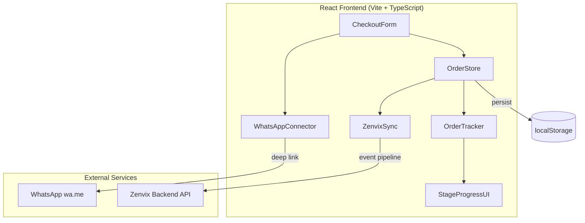
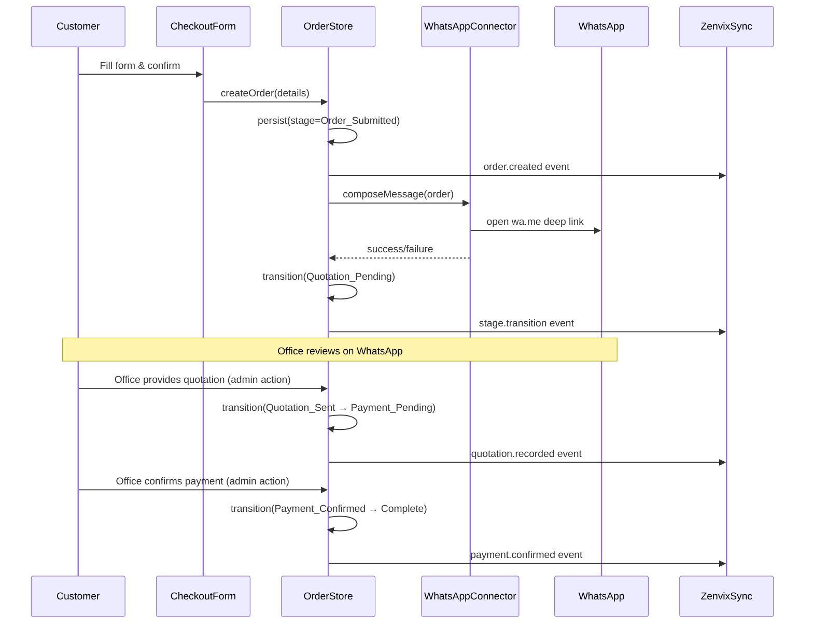

# Design Document: WhatsApp Checkout Flow

## Overview

This design replaces the current instant payment gateway checkout (card, bank transfer, e-wallet) with a WhatsApp-based quotation and payment flow. Instead of processing payments directly, the system sends order details to the Bambu Silver office via WhatsApp, where staff calculate delivery costs, provide a final quotation, and confirm payment manually.

The flow introduces a multi-stage order lifecycle managed client-side with localStorage persistence and Zenvix backend synchronization. The frontend tracks order stages (Order_Submitted → Quotation_Pending → Quotation_Sent → Payment_Pending → Payment_Confirmed → Complete) and provides a visual tracker for customers.

### Key Design Decisions

1. **Client-side order state management**: Orders are persisted in localStorage with Zenvix sync as a best-effort secondary store. This keeps the flow functional even when the backend is unreachable.
2. **WhatsApp deep link via wa.me**: Uses the standard `https://wa.me/{phone}?text={encoded_message}` URL scheme, which works cross-platform (mobile and desktop WhatsApp).
3. **No payment gateway integration**: Payment confirmation is a manual action triggered by office staff (or self-serve admin panel), removing all payment provider dependencies.
4. **Reuse existing Zenvix event pipeline**: Stage transitions are forwarded via the existing `trackEvent` + retry queue infrastructure.

## Architecture



### Component Responsibilities

| Component | Responsibility |
|-----------|---------------|
| `CheckoutForm` | Collects customer info, validates fields, triggers order creation |
| `WhatsAppConnector` | Composes structured message, URL-encodes, opens wa.me link |
| `OrderStore` | Manages order state, stage transitions, localStorage persistence |
| `OrderTracker` | Displays current stage, order details, and contextual messages |
| `ZenvixSync` | Fires Zenvix events on order creation and stage transitions |

### Flow Sequence



## Components and Interfaces

### 1. CheckoutForm (Refactored)

Replaces the existing `CheckoutPage.tsx`. Removes payment method selection, adds WhatsApp flow explanation.

```typescript
interface CheckoutFormData {
  customerName: string;
  customerEmail: string;
  customerPhone: string;
  shippingAddress: string;
}
```

**Validation**: Uses Zod schema (reusing existing pattern). All four fields required. Phone must be ≥5 chars, email must be valid, address ≥10 chars.

### 2. WhatsAppConnector

Pure utility module — no React state, no side effects beyond opening the link.

```typescript
interface WhatsAppMessage {
  orderId: string;
  customerName: string;
  customerPhone: string;
  customerEmail: string;
  shippingAddress: string;
  items: Array<{ title: string; quantity: number; unitPrice: number }>;
  subtotal: number;
}

interface WhatsAppConnectorResult {
  success: boolean;
  url: string;
  truncated: boolean;
}

function composeWhatsAppMessage(data: WhatsAppMessage): string;
function buildWhatsAppUrl(message: string, officePhone: string): string;
function openWhatsAppCheckout(data: WhatsAppMessage, officePhone: string): WhatsAppConnectorResult;
```

**Message format**:
```
🛒 *New Order — #{orderId}*

👤 *Customer*
Name: {name}
Phone: {phone}
Email: {email}

📍 *Shipping Address*
{address}

📦 *Items*
• {title} × {qty} — ${price}
• {title} × {qty} — ${price}

💰 *Subtotal: ${subtotal}*

📋 Please provide a quotation including delivery costs.
```

**Truncation strategy**: If encoded message exceeds 1000 characters, item details are trimmed to "({n} items — see order #{id})" while preserving reference ID and subtotal.

### 3. OrderStore

Client-side order state manager using localStorage.

```typescript
type OrderStage =
  | "Order_Submitted"
  | "Quotation_Pending"
  | "Quotation_Sent"
  | "Payment_Pending"
  | "Payment_Confirmed"
  | "Complete";

interface OrderRecord {
  id: string;
  stage: OrderStage;
  customerName: string;
  customerEmail: string;
  customerPhone: string;
  shippingAddress: string;
  items: Array<{ productId: string; title: string; quantity: number; unitPrice: number }>;
  subtotal: number;
  quotedDeliveryCost?: number;
  quotedTotal?: number;
  paidAmount?: number;
  userId?: string;
  createdAt: string;
  updatedAt: string;
  stageHistory: Array<{ stage: OrderStage; timestamp: string }>;
}

interface OrderStoreAPI {
  createOrder(data: Omit<OrderRecord, 'id' | 'stage' | 'createdAt' | 'updatedAt' | 'stageHistory'>): OrderRecord;
  transitionStage(orderId: string, newStage: OrderStage, metadata?: Partial<OrderRecord>): OrderRecord;
  getOrder(orderId: string): OrderRecord | null;
  getLatestOrder(): OrderRecord | null;
  getAllOrders(): OrderRecord[];
}
```

**Storage key**: `bambu_whatsapp_orders`

**Stage transition rules** (enforced):
- `Order_Submitted` → `Quotation_Pending`
- `Quotation_Pending` → `Quotation_Sent`
- `Quotation_Sent` → `Payment_Pending`
- `Payment_Pending` → `Payment_Confirmed`
- `Payment_Confirmed` → `Complete`

Invalid transitions throw an error.

### 4. OrderTracker (React Component)

Visual stage progress indicator + order details display.

```typescript
interface OrderTrackerProps {
  order: OrderRecord;
}
```

Uses the existing shadcn/ui components (`Card`, `Badge`, `Progress`) with the project's design system (rounded-[2.5rem], font-display, uppercase tracking).

### 5. ZenvixSync Integration

Leverages the existing `trackEvent` function from `src/api/zenvix-events.ts`. New event types:

| Event Type | Payload |
|-----------|---------|
| `order.placed` | `{ order_id, customer, items, subtotal }` |
| `order.stage_transition` | `{ order_id, from_stage, to_stage, timestamp }` |
| `order.quotation_recorded` | `{ order_id, delivery_cost, total }` |
| `payment.completed` | `{ order_id, amount, timestamp }` |

These reuse the existing `ZenvixUserEventType` union (already includes `order.placed` and `payment.completed`). New types `order.stage_transition` and `order.quotation_recorded` will be added to the union.

## Data Models

### OrderRecord (localStorage)

```typescript
// Stored as JSON array under key "bambu_whatsapp_orders"
interface PersistedOrderData {
  orders: OrderRecord[];
  version: 1;
}
```

### Stage Transition Map

```typescript
const VALID_TRANSITIONS: Record<OrderStage, OrderStage | null> = {
  Order_Submitted: "Quotation_Pending",
  Quotation_Pending: "Quotation_Sent",
  Quotation_Sent: "Payment_Pending",
  Payment_Pending: "Payment_Confirmed",
  Payment_Confirmed: "Complete",
  Complete: null,
};
```

### WhatsApp Configuration

```typescript
interface WhatsAppConfig {
  officePhone: string;  // Format: country code + number, no symbols (e.g., "6281234567890")
  maxMessageLength: number;  // Default: 1000 (wa.me URL text param limit)
}
```

Stored in environment variable `VITE_WHATSAPP_OFFICE_PHONE` with fallback in store config.

### Extended Zenvix Event Types

```typescript
// Added to ZenvixUserEventType union
| "order.stage_transition"
| "order.quotation_recorded"
```

## Correctness Properties

*A property is a characteristic or behavior that should hold true across all valid executions of a system — essentially, a formal statement about what the system should do. Properties serve as the bridge between human-readable specifications and machine-verifiable correctness guarantees.*

### Property 1: Order creation produces a complete persisted record

*For any* valid checkout form data (non-empty name, valid email, phone ≥5 chars, address ≥10 chars) and any non-empty list of cart items, creating an order SHALL produce a persisted OrderRecord in localStorage with stage `Order_Submitted`, all customer fields intact, all items preserved with correct quantities and prices, and a valid timestamp.

**Validates: Requirements 1.1**

### Property 2: WhatsApp message content completeness

*For any* valid order data (with customer name, phone, email, shipping address, a list of 1+ items each with title/quantity/price, a subtotal, and an order reference ID), the composed WhatsApp message SHALL contain: the customer name, phone, email, shipping address, section headers for customer info/shipping/items, each item's title, quantity, and unit price, the order subtotal, and the order reference ID.

**Validates: Requirements 1.2, 8.1, 8.2, 8.3, 8.4**

### Property 3: WhatsApp URL structure validity

*For any* composed message string and any valid office phone number (digits only, 10–15 chars), the generated URL SHALL match the pattern `https://wa.me/{phone}?text={encodedMessage}` where `{phone}` contains only digits and `{encodedMessage}` is a valid URL-encoded string.

**Validates: Requirements 1.3**

### Property 4: URL encoding round-trip

*For any* composed WhatsApp message string, URL-encoding the message and then decoding the encoded portion of the resulting URL SHALL produce the original message unchanged.

**Validates: Requirements 8.5**

### Property 5: Message truncation preserves order reference and subtotal

*For any* order data that produces a composed message exceeding 1000 characters (e.g., orders with many items or long descriptions), the truncated message SHALL be ≤1000 characters AND still contain the order reference ID and the subtotal value.

**Validates: Requirements 8.6**

### Property 6: Stage transition persistence

*For any* valid OrderRecord and any valid stage transition (as defined by the transition map), after performing the transition, the persisted data in localStorage SHALL reflect the new stage, contain an updated timestamp, and include a new entry in stageHistory with the new stage and timestamp.

**Validates: Requirements 5.1**

### Property 7: Checkout form validation correctness

*For any* combination of checkout form fields, the validation function SHALL return valid=true if and only if: name is non-empty after trim, email matches email format, phone is ≥5 chars after trim, and address is ≥10 chars after trim. For any input that fails one or more of these conditions, validation SHALL return valid=false with appropriate error messages for failing fields.

**Validates: Requirements 7.2**

### Property 8: Invalid stage transitions are rejected

*For any* OrderRecord at a given stage, attempting to transition to a stage that is not the defined next stage in the transition map SHALL throw an error and leave the order unchanged in localStorage.

**Validates: Requirements 3.2, 4.1**

## Error Handling

| Scenario | Handling Strategy |
|----------|-------------------|
| WhatsApp link fails to open | Display toast error with office phone number for manual contact. Order remains at `Order_Submitted` stage. |
| localStorage unavailable | Display warning banner. Order is created in memory only; user warned about session persistence. |
| localStorage quota exceeded | Attempt to clear old completed orders. If still failing, warn user. |
| Zenvix sync failure | Event queued for retry via existing `zenvix-events.ts` pipeline (exponential backoff, max 5 retries). |
| Invalid stage transition | Throw `Error` with descriptive message. UI displays toast. Order state unchanged. |
| Form validation failure | Display inline field errors using existing Zod validation pattern. Submit button stays disabled. |
| Network unavailable during checkout | Since the core flow uses wa.me (client-side URL) and localStorage, the checkout still works offline. Zenvix sync queues for later. |

### Error Recovery Patterns

- **Retry-safe**: All Zenvix events are idempotent (include order_id + timestamp) so retry is safe.
- **Graceful degradation**: The WhatsApp flow works entirely client-side; Zenvix sync is best-effort.
- **User-actionable errors**: All errors presented to users include a clear next action (contact office, retry, etc.).

## Testing Strategy

### Property-Based Tests (Vitest + fast-check)

The project uses Vitest (already configured). We'll add `fast-check` for property-based testing.

**Library**: `fast-check` (standard PBT library for TypeScript/JavaScript)
**Configuration**: Minimum 100 iterations per property test
**Tag format**: `Feature: whatsapp-checkout-flow, Property {N}: {title}`

Properties to implement as PBT:
1. Order creation persistence — generate random valid form data + item lists
2. Message content completeness — generate random order data, verify all fields present
3. URL structure validity — generate random messages + phone numbers
4. URL encoding round-trip — generate arbitrary strings, verify encode/decode identity
5. Message truncation — generate orders with many items exceeding 1000 chars
6. Stage transition persistence — generate random orders, apply valid transitions
7. Validation correctness — generate random field combinations (valid + invalid)
8. Invalid transition rejection — generate orders + invalid target stages

### Unit Tests (Vitest)

Example-based tests for:
- Specific stage transition sequences (happy path: Submitted → Pending → Sent → Payment → Confirmed → Complete)
- WhatsApp link opens successfully (mock `window.open`)
- WhatsApp link failure shows error with phone number
- Order tracker renders correct message per stage
- Checkout form renders without payment method section
- Checkout form shows WhatsApp explanation text
- localStorage unavailability warning
- Authenticated user ID association
- Latest order retrieval

### Integration Tests

- Zenvix event pipeline receives correct payloads on order creation
- Zenvix event pipeline receives correct payloads on stage transitions
- Zenvix event queue retry on failure
- End-to-end checkout flow: form submit → order created → WhatsApp opened → stage updated

### Component Tests (React Testing Library)

- `OrderTracker` renders all 6 stages with correct visual states
- `OrderTracker` highlights current stage
- `CheckoutForm` validates and submits correctly
- `CheckoutForm` button disabled until validation passes

